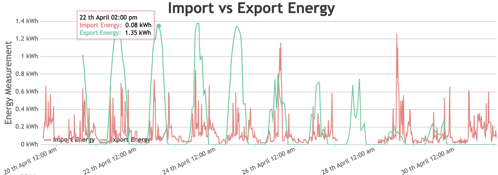
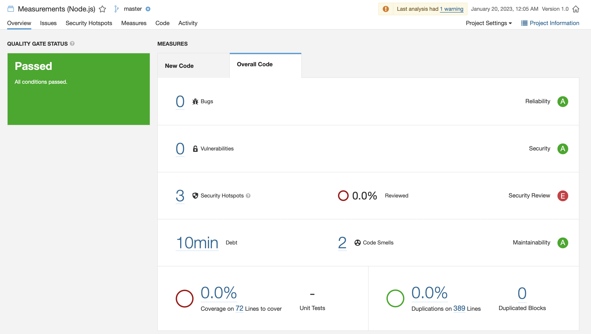

# Measurements (Node.js)
A simple app that shows statistics about the import and export energy.



## Concepts
it's **really important** to understand the following before heading to the other sections, so based on the following json structure:

 ```json
{
    "measurement": "energy",
    "timestamp": "2022-04-30T23:30:00.000Z",
    "tags": {
        "muid": "123-456-789",
        "quality": "measured"
    },
    "0100011D00FF": 0.0883,
    "0100021D00FF": 0
}
```

Let's understand the below:

* `measurement`: the type of measurement, and we have 2 types: `energy` and `power`

* `timestamp`: the time in which the electricity meter readings have been captrued(every 15 minutes).

* `muid`: smart meter ID

* `0100011D00FF`: it's called import energy and basically this is used to determine how much energy have been consumed.

* `0100021D00FF`: it's called export energy and basically this is used to determine how much energy have been produced.

## Getting started

you have 3 options to get started, and before choosing the appropriate option, you have to do the following for the last 2 options:

* copy `.env.example` and rename the copied file to `.env` and change all the details from that file

for the first and the secend options, project url is: `http://localhost:3000`

for the last option, project url is: `http://localhost`

**After choosing the appropriate option, navigate to the project url in the browser and then you will be able to start using the project.**

Please note that `LIMIT` in the configuration files is used to limit the number of data returned by the 3rd party API and setting it to `-1` will return all the data.

### (1) Kubernetes:

* copy `k8s/config.yaml.example` and rename the copied file to `config.yaml` and change all the details from that file

**Usage:**

```
kubectl apply -f ./k8s
```

**please note that:** if you are using `minikube`, you have to run `minikube tunnel` in the terminal

### (2) Docker:

**Usage:**

```
docker compose up -d
```

### (3) Local Installation:

* run `npm install`
* run `nodemon app.js`

## Tech Stack
* `Front-end`: HTML, CSS, Bootstrap, jQuery and JavaScript

* `Back-end`: Node.js, Express and MongoDB

* `DevOps`: Docker, Kubernetes and SonarQube

## Improvements

if I was to spend additional time on the project I would do the following:

* write unit tests
* updating backend architecture (ex: using express router)
* separate front-end and back-end

## Testing & Development

Here is the quality of the code before and after applying some SonarQube improvements:

Before:



After:


* You can run **SonarQube** by copying `sonar-project.properties.example` and saving it as `sonar-project.properties` and then update all the info, and after that you can run the following:

```
sonar-scanner
```

* You can check out the API docs from here: [API Documentation](https://documenter.getpostman.com/view/6359426/2s8ZDX4NNg)